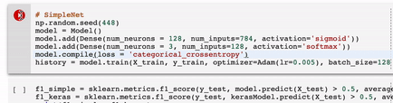

## Simple Deep Learning framework heavily inspired by Keras



In this project, I implement a CPU-based deep learning framework using nothing but Numpy. The API for the framework is heavily inspired by Keras, although the implementation is quite different. I test the framework on 3 different datasets: one is syntetically generated, and two popular datasets from UCI Data repositories. Eventually, I compare the results with the Tensorflow-CPU-backed version of the Keras. I conclude with the statement that the framework achieves equivalent to Keras learning performance while being simplier and more transparent for educational purposes.

## SimpleNet
The following is the implementation of the framework in Python.  The main abstractions are `Model` and `Dense`.  The framework design is highly oriented on fully-connected networks. Nevertheless the abstraction of a `Dense` layer stands alone from the `Model` which may have an arbitrary number of layers.

Other abstracted concepts are `Loss`,  `Activation`,  `Optimizer`. I implemented several activations:  linear, sigmoid and softmax, although the framework is open for other extensions. For optimizers, I implemented an SGD and Adam. The implementation of Adam is a little different from the one in Keras and is purely based on the Wikipedia definition. Finally, there are two loss functions supported: MSE and categorical cross entropy.

The computational part of the framework is inspired by the concept of computational graphs from http://www.deeplearningbook.org/. The computational graph in this architecture consists of the nodes of just one type: Layer, which can be broken down into the two operations: matrix multiplication and activation function. 
```
                                matmul  activation
                            W-->+---+  S  +---+  Z
                                + * +---->+ a +---->
                            X-->+---+     +---+
```
Each node (Layer) knows how to compute it's forward and backward pass for the two operations. For the last layer, the model uses a trick to aviod computing the derrivative of the output of the final activation function with respect to its input by using the simplified form of gradient for the loss function with respect to the input of the activation.  
